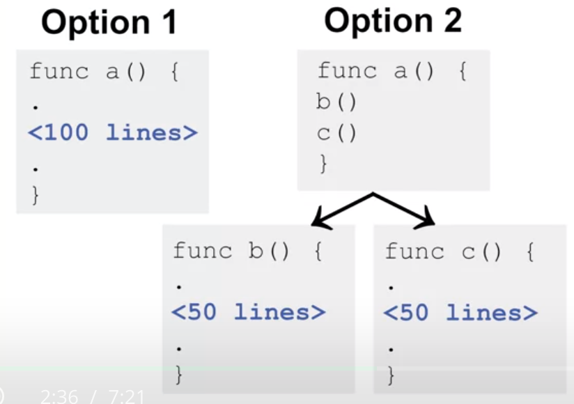

# Function Guidelines

## Function Complexity

- function length is the most obvious measure
- functions should be simple
  - easier to debug
- short functions can be complicated too

## Function Length

- how do you write complicated code with simple functions?
- Function Call Hierarchy
  
  - option 2 would be easier to understand and debug

## Control-Flow Complexity

- control-flow describes conditional paths

```golang
func foo(){
  if a == 1{
    if b == 1{
      //...
    }
  }
  //...
}
```

- 3 control-flow paths

### Partitioning Conditionals

- functional hierarchy can reduce control-flow complexity

```golang
func foo(){
  if a == 1{
    CheckB()
  }
  // ...
}
func CheckB(){
  if b == 1{
    // ...
  }
}
```

- 2 control-flow paths in each function
