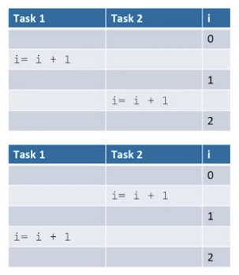
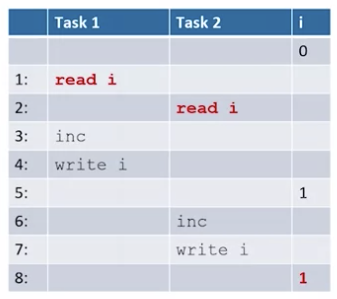

# Threads In Go

## Mutual Exclusion

### Goroutines Sharing Variables

- sharing variables concurrently can cause problems
- two goroutines writing to a shared variable can interfere with each other

### Concurrency-Safe

- function can be invoked concurrently without interfering with other goroutines

### Variable Sharing Example

```golang
var i int = 0
var wg sync.WaitGroup
func inc(){
  i += 1
  wg.Done()
}
func main(){
  wg.Add(2)
  go inc()
  go inc()
  wg.Wait()
  fmt.Println(i)
}
```

- two goroutine write to `i`
- `i` should equal 2, but it doesn't always happen
  - usually because of interleavings

#### Possible Interleavings

- seems like there is no problem



## Granularity of Concurrency

- concurrency is at the machine code level
- `i += 1` might be three machine instructions
  - this is where interleaving can happen
    - read i
    - increment
    - write i
- interleaving machine instructions causes unexpected problems

## Interleaving Machine Instructions

- both tasks read 0 for `i` value



## Mutex

### Correct Sharing

- don't let 2 goroutines write to a shared variable at the same time!
- need to restrict possible interleavings
- access to shared variables cannot be interleaved

### Mutual Exclusions

- code segments in different goroutines which cannot execute concurrently
- writing to shared variables should be mutually exclusive

### Sync.Mutex

- a mutex ensures mutual exclusion
- uses binary sempahore


- flag up: shared variable is in use
- flag down: shared variable is available

### Sync.Mutex Methods

- `Lock()` method puts the flag up
  - shared variable is in use
- if lock is already taken by a goroutine, `Lock()` blocks until the flag is put down
- `Unlock()` method puts the flag down
  - done using shared variable
- when `Unlock()` is called, a blocked `Lock()` can be proceed

### Using Sync.Mutex Methods

- increment operation is now mutually exclusive

```golang
var i int = 0
var mut sync.Mutex
func inc(){
  mut.Lock()
  i += 1
  mut.Unlock()
}
```
