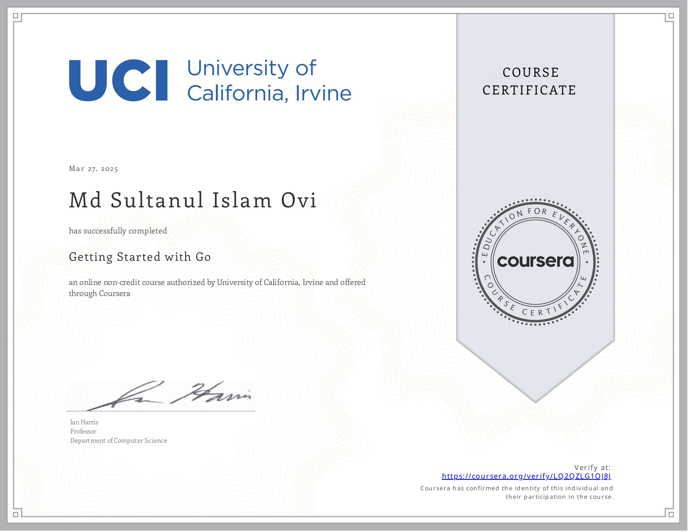

# Programming with Google Go Specialization

Notes for Go Specialization From Coursera Offered By University of California, Irvine (3 courses)

## Course Link: [Programming with Google Go Specialization](https://www.coursera.org/specializations/google-golang)

This specialization introduces the Go programming language from Google and provides learners with an overview of Go's special features. Upon completing the three-course sequence, learners will have gained the knowledge and skills needed to create concise, efficient, and clean applications using Go.

Course 01: Getting Started with Go

Learn the basics of Go, an open source programming language originally developed by a team at Google and enhanced by many contributors from the open source community. This course is designed for individuals with previous programming experience using such languages as C, Python, or Java, and covers the fundamental elements of Go. Topics include data types, protocols, formats, and writing code that incorporates RFCs and JSON. Most importantly, you’ll have a chance to practice writing Go programs and receive feedback from your peers. Upon completing this course, you'll be able to implement simple Go programs, which will prepare you for subsequent study at a more advanced level.

Course 02:

Continue your exploration of the Go programming language as you learn about functions, methods, and interfaces. Topics include the implementation of functions, function types, object-orientation in Go, methods, and class instantiation. As with the first course in this series, you’ll have an opportunity to create your own Go applications so you can practice what you’re learning.

Course 03:

Learn how to implement concurrent programming in Go. Explore the roles of channels and goroutines in implementing concurrency. Topics include writing goroutines and implementing channels for communications between goroutines. Course activities will allow you to exercise Go’s capabilities for concurrent programming by developing several example programs.

Specialization Overview
Welcome to the Programming with Google Go Specialization!

This intermediate-level, three-course sequence is designed for individuals who have had some experience programming in another language but now wish to learn about the features and capabilities of Go. The courses provide a review of essential programming concepts, as needed, to ensure that all learners are sufficiently comfortable with the basics before learning about the features that are peculiar to Go. (Please note that the original specialization design called for four courses but development of the fourth course has been deferred to a later time. For now, please disregard the occasional references that the instructor makes to this fourth course.)

The first course, Getting Started with Go, introduces the basic elements of the language including unique features such as slices that are not available in other programming environments. The second course, Functions, Methods, and Interfaces in Go, expands your knowledge of Go with a focus on object-oriented features such as classes and encapsulation, and allows you to practice writing code to solve practical problems. The third and final course, Concurrency in Go, shows you how to write Go code that executes more rapidly through parallel execution in multi-processor environments.

The courses feature video lectures by Professor Ian Harris from the University of California, Irvine and are accompanied by automatically graded multiple-choice quizzes and peer-reviewed programming assignments. While most of the information needed to complete the programming assignments is presented within the context of the courses (i.e. by the lecturer), we encourage students to take advantage of the many resources that are available online for clarification and further learning.

## Other resources:

- [Codecademy courses](https://www.codecademy.com/catalog/language/go)
- [Codecademy cheatsheets](https://www.codecademy.com/resources/cheatsheets/language/go)
- [Projects](https://www.codecademy.com/projects/language/go)
- [gobyexample](https://gobyexample.com/)
- [w3school](https://www.w3schools.com/go/index.php)
- Need to find a good book on this topic
