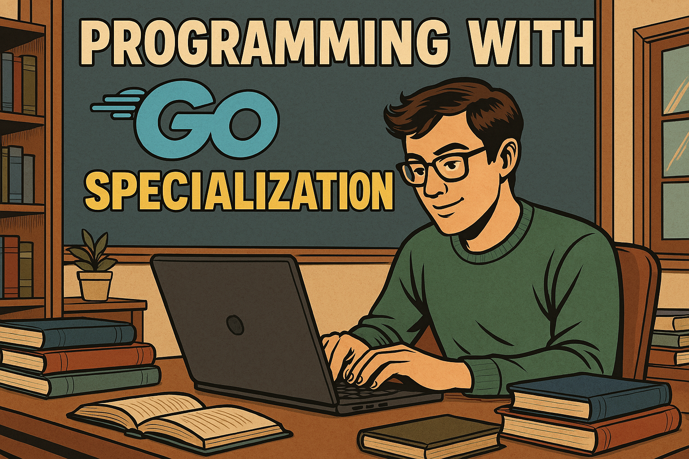
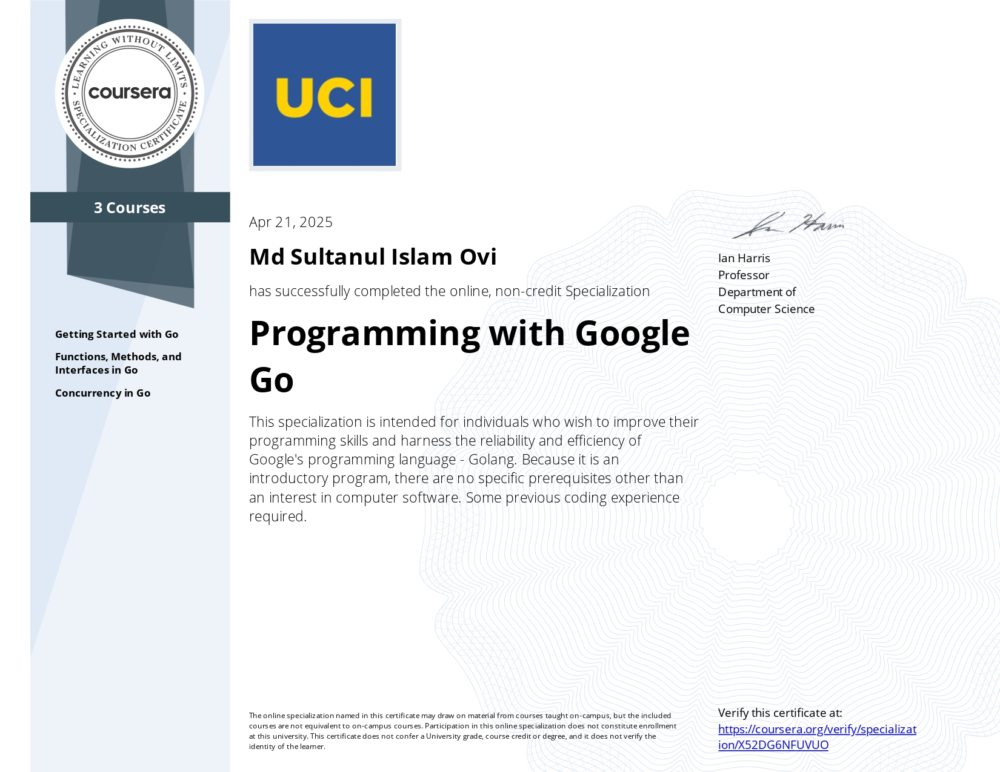
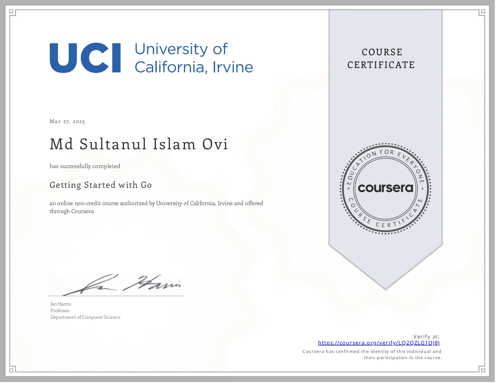
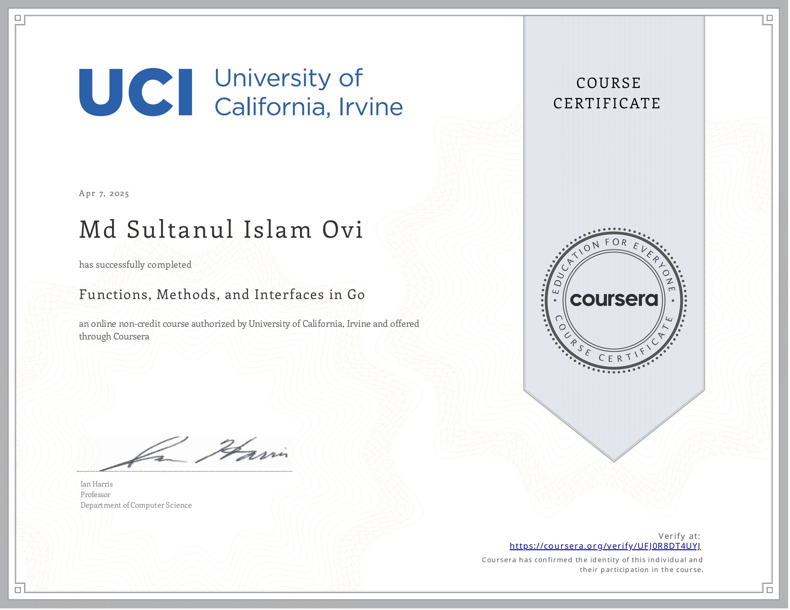
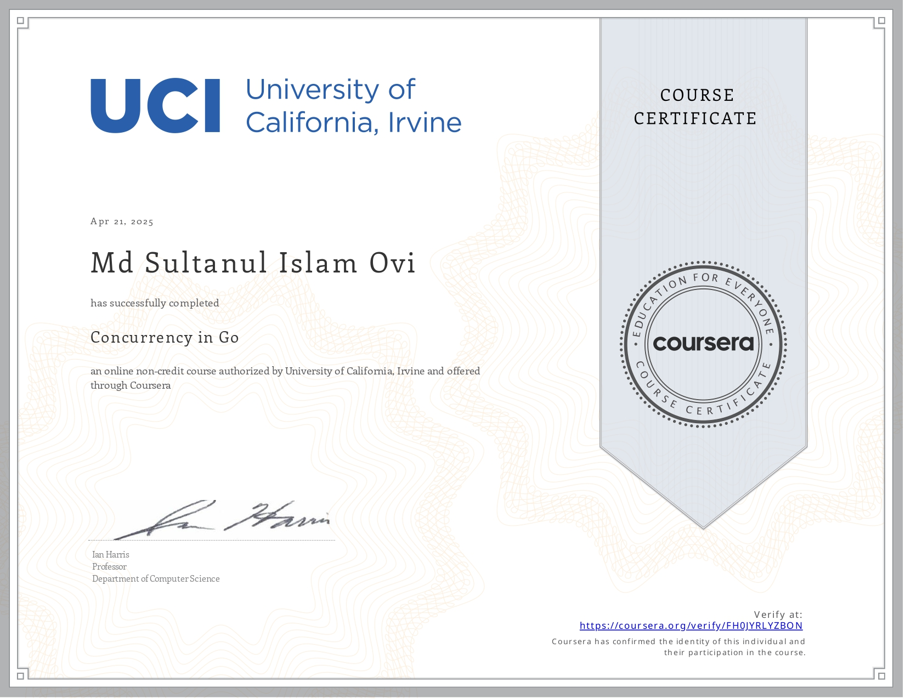

📚 _Notes & Certificates from the Coursera Specialization by University of California, Irvine_

> This repository documents my journey through the **Programming with Google Go Specialization** on Coursera. It includes course descriptions, certificates, and helpful learning resources.

---

## 📌 Specialization Overview

This intermediate-level, three-course specialization introduces the **Go (Golang)** programming language developed by Google. The series builds a strong foundation in Go’s syntax, functions, methods, interfaces, and concurrency models — preparing learners to build efficient, clean, and high-performance applications.

🎓 **[View the Specialization on Coursera »](https://www.coursera.org/specializations/google-golang)**

---

## 📘 Courses Breakdown

### ✅ Course 1: Getting Started with Go

> Learn Go basics: data types, control structures, functions, and JSON handling.

---

### ✅ Course 2: Functions, Methods, and Interfaces in Go

> Deep dive into Go’s object-oriented patterns: methods, interfaces, and class-like structures.

---

### ✅ Course 3: Concurrency in Go

> Master goroutines and channels to write concurrent programs in Go.

---

## 🧠 Key Highlights

- 👨‍🏫 Instructor: Prof. Ian Harris (UC Irvine)
- 📹 Course Format: Video lectures, quizzes, and peer-reviewed assignments
- 🧑‍💻 Designed for learners with prior programming experience (C, Python, Java, etc.)

---

## 📚 Recommended Learning Resources

Here are some additional platforms and tools I used to supplement the specialization:

- 🎓 [Codecademy: Go Courses](https://www.codecademy.com/catalog/language/go)
- 📝 [Codecademy: Go Cheatsheets](https://www.codecademy.com/resources/cheatsheets/language/go)
- 💡 [Codecademy: Go Projects](https://www.codecademy.com/projects/language/go)
- 📘 [Go by Example](https://gobyexample.com/)
- 🌐 [W3Schools: Go Tutorial](https://www.w3schools.com/go/index.php)
- 📖 _(Still looking for a great Go programming book — suggestions welcome!)_

---

## 💬 Connect

If you're also learning Go or have recommendations for books or tools, feel free to open an issue or connect with me!

---
