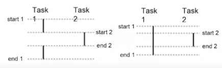
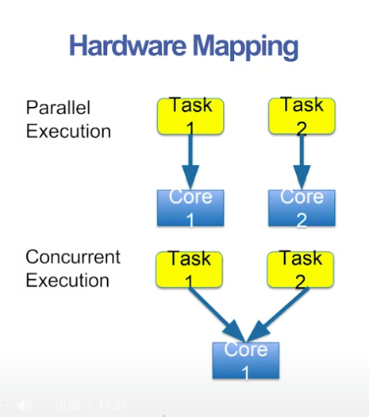
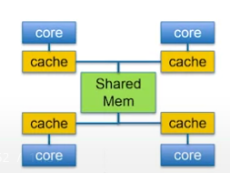

# Concurrent Execution

- concurrent execution is not necessarily the same as parallel execution
- *Concurrent*: start and end times overlap
- *Parallel*: execute at exactly the same time

## Concurrency vs Parallelism

- parallel tasks must be executed on different hardware
- concurrent tasks may be executed on the same hardware
  - only one task actually executed at a time
- mapping from tasks to hardware is not idrectly controlled by the programmer
  - at least not in go

## Concurrent Programming

- programmer determines which tasks can be executed in parallel
- mapping tasks to hardware
  - operating system
  - go runtime scheduler

## Hiding Latency

- concurrency improves performance, even without parallelism
- tasks must periodically wait for something
  - i.e. wait for memory
  - `x = y + z // read y, z from memory`
  - may wait 100+ clock cycles
- other concurrent tasks can operate while on task is waiting

## Hardware Mapping in Go

- programmer does not determine the hardware mapping
- programmer makes parallelism possible
- hardware mapping depends on many factors

