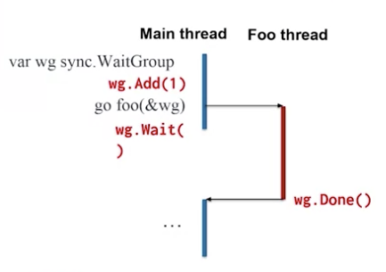

# Threads in Go

## Synchronization

- using global events whose execution is viewed by all threads simultaneously

## Synchronization Example

```golang
// task 1
x = 1
x = x + 1
GLOBAL_EVENT

// task 2
if GLOBAL_EVENT
  print x

```

- GLOBAL_EVENT is viewed by all tasks at the same time
- print must occur after update of x
- sychronization is used to restrict bad interleavingsm

## Sync WaitGroup

- sync package contains functions to synchronize between goroutines
- `syng.WaitGroup` forces a goroutine to wait for other goroutines
- contains an internal counter
  - increment counter for each goroutine to wait for
  - decrement counter when each goroutine completes
  - waiting goroutine cannot continue until counter is 0



- `Add()` increments the counter
- `Done()` decrements the counter
- `Wait()` blocks until counter == 0

```golang
func foo (wg *sync.WaitGroup){
  fmt.Printf("New routine")
  wg.Done()
}

func main(){
  var wg sync.WaitGroup
  wg.Add(1)
  go foo(&wg)
  wg.Wait()
  fmt.Printf("Main routine")
}
```
