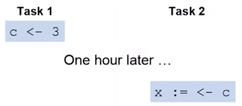
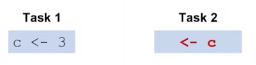
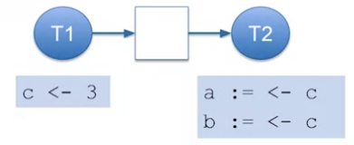
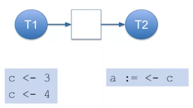
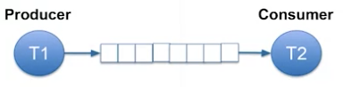

# Threads In Go

## Goroutine Communication

- goroutines usually work together to perform a bigger task
- often need to send data to collaborate
- example: find the product of 4 integers
  - make 2 goroutines, each multiplies a pair
  - main goroutine multiplies the 2 results
- need to send ints from main routine to the two sub-routines
- need to send results from sub routines back to main routine

## Channels

- transfer data between goroutines
- channels are typed
- use`make()` to create a channel: `c := make(chan int)`
- send and receive data use the `<-` operator
- send data on  a channel: `c <- 3`
- receive data from a channel: `x := <- c`

```golang
func prod (v1 int, v2 int, c chan int) {
  c <- v1 * v2
}

func main(){
  c := make(chan int)
  go prod(1,2,c)
  go prod(3,4,c)
   a := <- c
   b := <- c
   fmt.Println(a*b)
}
```

## Blocking in Channels

### Unbuffered Channel

- unbuffered channels cannot hold data in transit
  - default is unbuffered
- sending blocks until data is received
- receiving blocks until data is sent



### Blocking and Synchronization

- channel communication is synchronus
- blocking is the same as waiting for communication



- task 2 is throwing away data but is synchronizing with task 1
- receiving and ignoring the resuls is same as a `Wait()`

### Buffered Channel

- channels can contain a limited number of objects
  - default size 0 (unbuffered)
- **Capacity** is the number of objects it can hold in transit
- optional argument to `make()` defines channel capacity
  - `c := make(chan int, 3)`
- sending only blocks if **buffer is full**
- receiving only blocks if buffer is empty
- **NOT RECOMMENDED**: blocking could potentially mean reducing concurrency, unable to execute, and therefore waste processor resources

### Channel Blocking, Receive

- channel with capacity 1



- first receive blocks until send occurs
- second receive blocks forever

### Channel Blocking, Send



- second send blocks until receive is done
- receive can block until first send is done

### Use of Buffering

- sender and receiver do not need to operate at exactle the same speed



- speed mismatch is acceptable
- average speeds must still match
