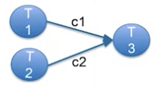

# Synchronized Communication

## Blocking on Channels

### Iterating Through a Channel

- common to iteratively read from a channel

```golang
for i := range c {
  fmt.Println(i)
}
```

- continues to read from channel c
- one iteration each time a new value is received
- `i` is assigned to the read value
  - infinite loop until a channel `close` happens

### Receiving from Multiple Goroutines

- multiple channels may be used to receive from multiple sources



- data, `c1` and `c2`, from both sources, `T1` and `T2`, may be needed
  - read sequentially

```golang
  a := <- c1
  b := <- c2
  fmt.Println(a*b)
```

### Select Statement

- may have a choice of which data to use
  - i.e. first-come first-served
- use the `select` statement to wait on the first data from a set of channels

```golang
select{
  case a = <- c1:
    fmt.Println(a)
  case b = <- c2:
    fmt.Println(b)
}
```

## Select

### Select Send or Receive

- may select either send or receive operations

```golang
select{
  case a = <- inchan:
    fmt.Println("Received a")
  case outchan <- b:
    fmt.Println("sent b")
}
```

### Select with an Abort Channel

- use select with a separate abort channel
- may want to receive data until an abort signal is received
- following is an infinite loop until `abort` happens

```golang
for{
  select{
    case a <- c:
      fmt.Println(a)
    case <- abort:
      return
  }
}
```

### Default Select

- may want a default operation to avoid blocking

```golang
select{
  case a = <- c1:
    fmt.Println(a)
  case b = <- c2:
    fmt.Println(b)
  default:
    fmt.Println("noop")
}
```
