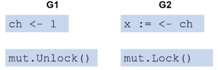

# Once Synchronization

## Synchronous Initialization

### Initialization

- must happen once
- must happen before everything else
- how do you perform initialization with multiple goroutines
  - could perform initialization before starting the goroutines

### Sync.Once

- has one method, `once.Do(f)`
- fuction f is executed only one time
  - even if it is called in multiple goroutines
- all calls to `once.Do()` block until the first returns
  - ensures that initialization executes first

#### Sync.Once Example

- make two goroutines, initialization only once
- each goroutine executes `dostuff()`

```golang
var wg sync.WaitGroup
func main(){
  wg.Add(2)
  go dostuff()
  go dostuff()
  wg.Wait()
}
```

#### Using Sync.Once

- `setup()` should execute only once
- "hello" should not print until `setup()` returns

```golang
var on sync.Once
func setup(){
  fmt.Println("init")
}
func dostuff(){
  on.Do(setup)
  fmt.Println("hello")
  wg.Done()
}
```

```output
Init // Result of setup()
Hello // Result of one goroutine
hello // Result of the other goroutine
```

- `Init` appears only once
- `Init` appears before hello is printed

## Deadlock

- a problem in synchronization

### Synchronization Dependencies

- synchronization causes the execution of different goroutines to depend on each other



- G1 is writing 1 into channel
- G2 is reading from channel
- G2 can't execute until G1 finishes writing
  - G2 waits since G1 has to write from channel
  - G2 depends on G1
- data is passed from G1 to G2
- same with the Mutex:
  - G2 can't accept any data until G1 unlocks
- either way, G2 cannot continue until G1 does something

### When There's Deadlock

- **Circular Dependencies** cause all involved goroutines to block
  - G1 waits for G2
  - G2 waits for G1
- can be caused by waiting on channels

### Deadlock Example

```golang

func dostuff(c1 chan int, c2 chan int) {
  <- c1
  c2 <- 1
  wg.Done()
}
```

- read from first channel
  - wait for write onto first channel
- write to second channel
  - wait for read from second channel

### Deadlock Example cont

```golang
func main(){
  ch1 := make(chan int)
  ch2 := make(chan int)
  wg.Add(2)
  go dostuff(ch1,ch2)
  go dostuff(ch2,ch1)
  wg.Wait()
}
```

- `dostuff()` argument order is swapped
- each goroutine blocked on channel read
- both goroutines are blocked because `dostuff()` makes it in such a way that both channels are waiting for each other concurently

### Deadlock Detection

- golang runtime automatically detects when all goroutines are deadlocked
- cannot detect when a subset of goroutines are deadlocked

## Dining Philosophers Problem

- classic problem involving concurrency and synchronization

### Problem

- 5 philosophers sitting at a round table
- 1 chopstick is placed between each adjacent pair
- each philosopher wants to eat rice from their place, but needs two chopsticks
- only one philosopher can hold a chopstick at a time
- not enough chopsticks for everyone to eat at once

### Issue


- each chopstick is a mutex
- each philosopher is associated with a goroutine and two chopsticks

### Chopsticks and Philosophers Code Implementation

```golang
type ChopS struct { sync.Mutex}

type Philo struct { leftCS, rightCS *ChopS }

func (p Philo) eat(){
  for{
    p.leftCS.Lock()
    p.rightCS.Lock()

    fmt.Println("eating")

    p.rightCS.Unlock()
    p.leftCS.Unlock()
  }
}

// presentation of code on slide doesn't explicitly add WaitGroup

func main(){
  CSticks := make([]*ChopS, 5)

  for i := 0; i < 5; i++{
    CSticks[i] = new(ChopS)
  }

  philos := make([]*Philo, 5)

  for i := 0; i < 5; i++{
    philos[i] = &Philo{Csticks[i], Csticks[(i+1)%5]}
  }
}
```

- initialize chopsticks and philosophers
- notice `(i+1)%5`: last philosopher uses the first chopstick (refer back to the round table)

### Start Dining in Main

```golang
for i := 0; i < 5; i++{
  go philos[i].eat()
  // needs WaitGroup here, but slides didn't include it
  // professor wanted to focus on the philosophers
}
```

- start each philosopher eating
- would also need to Wait in the main
- above implementation is naive way

### Deadlock Problem

```golang
  p.leftCS.Lock()
  p.rightCS.Lock()

  fmt.Println("eating")

  p.rightCS.Unlock()
  p.leftCS.Unlock()
```

- all philosophers might lock their left chopsticks concurrently
- all chopsticks would be locked
- no one can lock their right chopsticks
- interleaving that can result into a deadlock

### Deadlock Solution

- each philosopher picks up lowest numbered chopstick first

```golang
// current code
// here, philosopher 4 picks up the lowest numbered chopstick
philos[i] = &Philo{Csticks[i], Csticks[(i+1)%5]}
```

#### How it should be (kind of)

- philosopher 4 picks up chopstick 0 before chopstick 4
- philosopher 4 blocks allowing philosopher 3 to eat
- no deadlock but philosopher 4 may starve
